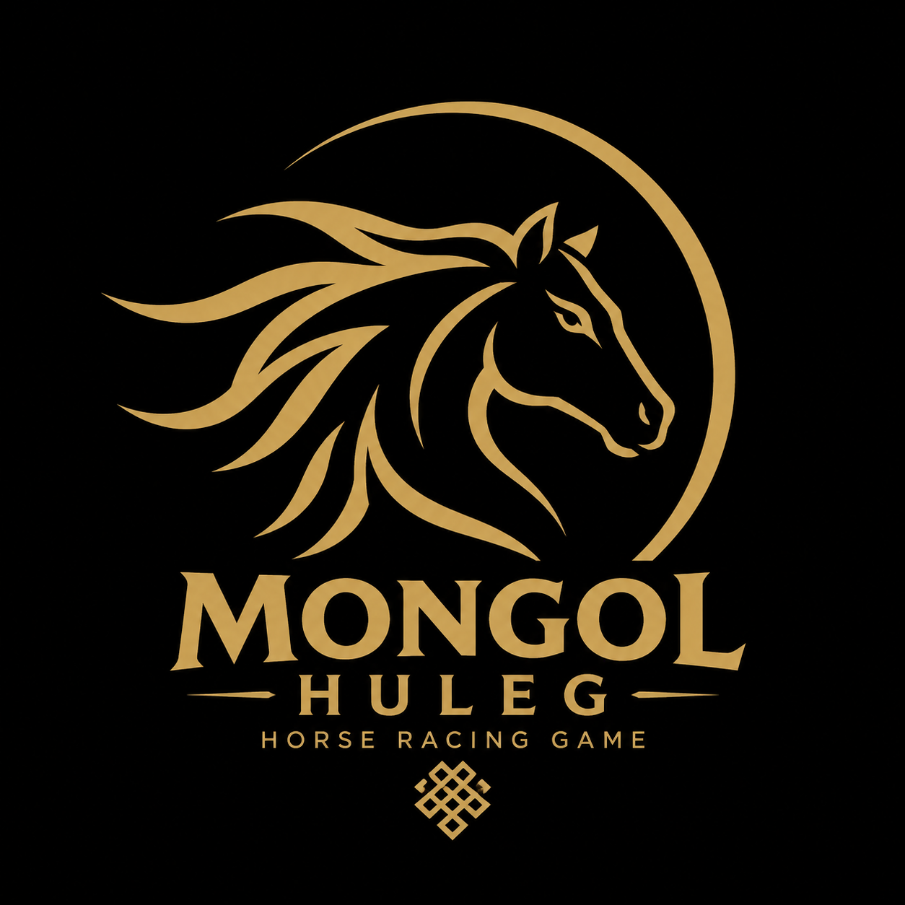

# 🏇 Mongol Huleg

**Mongol Huleg** is a horse racing game inspired by Mongolian culture, developed by **Andar Studio**.

Race your horses, join tournaments, and experience Mongolian horse racing.

---

## 🎮 Features

- 🐎 Horse racing gameplay
- 🏆 Tournament system
- 🐴 Own and name horses
- 👤 Player accounts
- 💎 Coin and diamond system
- 💬 Community features
- 🌍 Multiplayer features 

---

## 📱 Platforms

### Android
✅ Available

### Windows
✅ Available

---

## ⚙️ Minimum Requirements

### Android

- Android 7.0 or newer
- ARM64 support
- 2GB RAM or more
- 2GB storage space

### Windows

- Windows 7 or newer
- Intel Core i3 or equivalent
- 4GB RAM
- Intel HD Graphics or better

---

## 📥 Download

Get the latest version from GitHub Releases:

[Download Mongol Huleg](https://github.com/Andarstudio/MH/releases/latest)

---

## 🌐 Community

Join our Discord community:

[Join Discord](https://discord.gg/mrCsBhHgu)

---

## 📞 Contact

**Developer:** Amartuvshin

**Studio:** Andar Studio

**Email:**
erdenemandakhamartuvshin@outlook.com

**Messenger:**
https://m.me/Amartuvsin0

**Website:**
https://andarstudio.github.io/AndarStudio/

---

## 📄 Privacy Policy

[View Privacy Policy](pp.html)

---

## 👨‍💻 Developer

Created by **Andar Studio**

© 2026 Andar Studio. All rights reserved.
